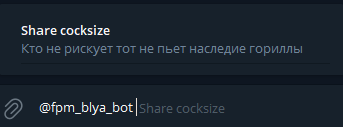
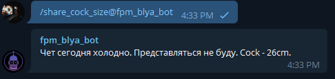

# @fpm_blya_bot

---
@fpm_blya_bot is a bot for fun messaging in chats

### Functional description

---
1. Inline query (write in any chat "@fpm_blya_bot [...]" to see an option):\

2. Live chatting with bot in groups or bot's direct chat:\

### Install instruction

---
Use VPN if Telegram Api is unavailable in your country.

<b>Use existing docker-compose.yml file to run the server via terminal command</b>

    docker-compose up

<b>Bot works via webhook technology. You need to set webhook link via following link:</b>

    https://api.telegram.org/{bot_token}}/setWebhook?url={webhook-link}

You can read more about it at https://hevodata.com/learn/telegram-webhooks/#i2

You could get current state of bot via following link:

    https://api.telegram.org/{bot_token}/getWebhookInfo